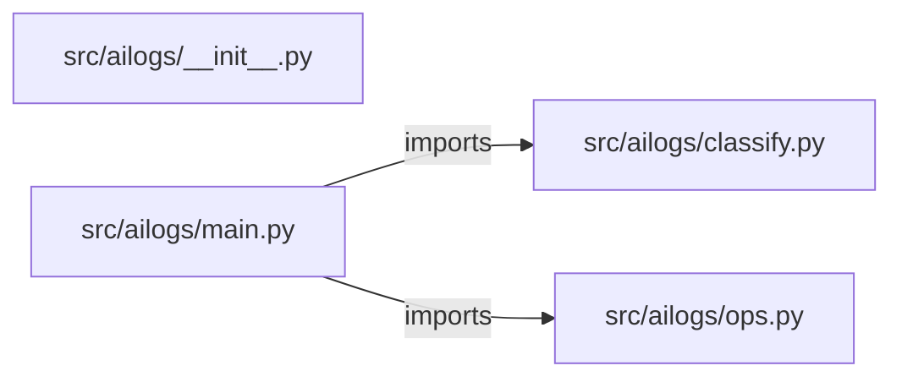

# ai-log-analysis-platform — project architecture

[README](README.md) · [Interview questions and answers](INTERVIEW_QA.md)

## Purpose and scope

This is a local laptop proof. It does not call a hosted model and it does not apply production changes.

This document describes files and symbols in this checkout. Deployment templates and statements in the original overview are distinguished from a verified running environment.

## Component diagram



For Python repositories, arrows show resolved local imports, not network calls or deployment order. Otherwise the diagram is a repository component map; containment arrows do not assert runtime integration.

## Components and responsibilities

| Component | Responsibility |
| --- | --- |
| [`src/ailogs/main.py`](src/ailogs/main.py) | HTTP handlers: `GET /healthz`, `POST /classify` |
| [`src/ailogs/ops.py`](src/ailogs/ops.py) | HTTP handlers: `GET /readyz`, `POST /workspaces`, `GET /workspaces`, `POST /workspaces/{workspace_id}/jobs`, `GET /jobs/{job_id}` |
| [`src/ailogs/classify.py`](src/ailogs/classify.py) | Functions: `classify` |
| [`requirements.txt`](requirements.txt) | Implementation or supporting configuration |
| [`src/ailogs/__init__.py`](src/ailogs/__init__.py) | Implementation or supporting configuration |
| [`Dockerfile`](Dockerfile) | Container build/service configuration |
| [`Makefile`](Makefile) | Implementation or supporting configuration |
| [`docker-compose.yml`](docker-compose.yml) | Container build/service configuration |
| [`tests/test_classify.py`](tests/test_classify.py) | Executable checks and regression examples |
| [`tests/test_ops.py`](tests/test_ops.py) | Executable checks and regression examples |
| [`.github/workflows/ci.yml`](.github/workflows/ci.yml) | GitHub Actions job definitions |
| [`README.md`](README.md) | Project explanations or operating notes |
| [`docs/ARCHITECTURE.md`](docs/ARCHITECTURE.md) | Project explanations or operating notes |

## Existing design and operating guides

These checked-in guides provide the project’s detailed design, operational context, or deployment view:

- [`docs/ARCHITECTURE.md`](docs/ARCHITECTURE.md).

## Request interface

| Method and path | Handler | Source |
| --- | --- | --- |
| `GET /healthz` | `healthz` | [`src/ailogs/main.py`](src/ailogs/main.py#L10) |
| `POST /classify` | `post_classify` | [`src/ailogs/main.py`](src/ailogs/main.py#L15) |
| `GET /readyz` | `readyz` | [`src/ailogs/ops.py`](src/ailogs/ops.py#L74) |
| `POST /workspaces` | `create_workspace` | [`src/ailogs/ops.py`](src/ailogs/ops.py#L80) |
| `GET /workspaces` | `list_workspaces` | [`src/ailogs/ops.py`](src/ailogs/ops.py#L98) |
| `POST /workspaces/{workspace_id}/jobs` | `create_job` | [`src/ailogs/ops.py`](src/ailogs/ops.py#L106) |
| `GET /jobs/{job_id}` | `get_job` | [`src/ailogs/ops.py`](src/ailogs/ops.py#L130) |
| `POST /jobs/{job_id}/approve` | `approve_job` | [`src/ailogs/ops.py`](src/ailogs/ops.py#L140) |
| `GET /audit` | `audit` | [`src/ailogs/ops.py`](src/ailogs/ops.py#L160) |
| `GET /metrics` | `metrics` | [`src/ailogs/ops.py`](src/ailogs/ops.py#L176) |

The table lists literal route decorators found in the inspected Python modules. Router prefixes and middleware can add behavior; check the linked handler and application setup before calling an endpoint.

## Implementation walkthrough

### `classify(text)`

Source: [`src/ailogs/classify.py`](src/ailogs/classify.py#L12).

Calls visible in this function: `InputError`, `all`, `counts.values`, `isinstance`, `len`, `max`, `re.findall`, `sum`, `text.lower`, `text.strip`.

```python
def classify(text):
    if not isinstance(text, str) or not text.strip():
        raise InputError("Text is empty.")
    tokens = re.findall(r"[a-z0-9]+", text.lower())
    counts = {}
    counts['oom'] = sum(token in OOM for token in tokens)
    counts['timeout'] = sum(token in TIMEOUT for token in tokens)
    counts['auth'] = sum(token in AUTH for token in tokens)
    label = max(counts, key=lambda name: (counts[name], name))
    if all(value == 0 for value in counts.values()):
        label = "unknown"
    return {"label": label, "counts": counts, "tokens": len(tokens)}
```

## Validation and failure paths

| Explicit exception | Source |
| --- | --- |
| `InputError('Text is empty.')` | [`src/ailogs/classify.py`](src/ailogs/classify.py#L14) |
| `HTTPException(status_code=422, detail=str(exc))` | [`src/ailogs/main.py`](src/ailogs/main.py#L19) |
| `HTTPException(status_code=404, detail='workspace not found')` | [`src/ailogs/ops.py`](src/ailogs/ops.py#L77) |
| `HTTPException(status_code=404, detail='job not found')` | [`src/ailogs/ops.py`](src/ailogs/ops.py#L100) |
| `HTTPException(status_code=404, detail='job not found')` | [`src/ailogs/ops.py`](src/ailogs/ops.py#L109) |
| `HTTPException(status_code=403, detail='production apply is disabled in this lab')` | [`src/ailogs/ops.py`](src/ailogs/ops.py#L113) |

These are explicit exceptions in the inspected source, rather than a claim that every failure is handled. Follow the calling handler to see whether the exception becomes an HTTP response or propagates.

## Data and state

- [`src/ailogs/classify.py`](src/ailogs/classify.py) defines module-level containers: `OOM`, `TIMEOUT`, `AUTH`.
- [`src/ailogs/ops.py`](src/ailogs/ops.py) defines module-level containers: `_WORKSPACES`, `_JOBS`, `_AUDIT`, `_METRICS`.

Module-level dictionaries/lists live in a Python process. They can be fixtures or mutable state; inspect writes before treating them as persistent storage. A production extension would need to define persistence and concurrency behavior explicitly.

## Data flow and design decisions

### What is the input-to-output contract of `classify`

In [`src/ailogs/classify.py`](src/ailogs/classify.py#L12), `classify(text)` receives the inputs. The function computes these intermediate values:

- `tokens = re.findall('[a-z0-9]+', text.lower())`
- `counts = {}`
- `counts['oom'] = sum((token in OOM for token in tokens))`
- `counts['timeout'] = sum((token in TIMEOUT for token in tokens))`
- `counts['auth'] = sum((token in AUTH for token in tokens))`
- `label = max(counts, key=lambda name: (counts[name], name))`

Its result is defined by:

- `{'label': label, 'counts': counts, 'tokens': len(tokens)}`

### Which decision rules or boundary conditions should an interviewer challenge

The implementation in [`src/ailogs/classify.py`](src/ailogs/classify.py#L12) branches on:

- `not isinstance(text, str) or not text.strip()`
- `all((value == 0 for value in counts.values()))`

A useful extension is a table-driven test that covers each condition just below, at, and above its boundary where applicable. These expressions are the current rules; changing them changes behavior and should be justified by the project’s acceptance criteria.

### What does the operations plane add, and where is its limit

[`src/ailogs/ops.py`](src/ailogs/ops.py) declares `GET /readyz`, `POST /workspaces`, `GET /workspaces`, `POST /workspaces/{workspace_id}/jobs`, `GET /jobs/{job_id}`, `POST /jobs/{job_id}/approve`, `GET /audit`, `GET /metrics`. Inspect the application’s `include_router` call for its URL prefix.

Its state containers are `_WORKSPACES`, `_JOBS`, `_AUDIT`, `_METRICS`. The job-approval handler defines whether a target is accepted or refused; check that branch and the associated tests instead of treating a recorded job as a successful infrastructure apply.

## Setup and verification

The following commands are derived from the checked-in dependency/test contracts. Execute them from the repository root; the block prepares a local environment, not a cloud deployment.

```bash
python3 -m venv .venv
source .venv/bin/activate
python -m pip install -r requirements.txt
python -m pytest -q
```

Python dependencies: [`requirements.txt`](requirements.txt).

Test entry points: [`tests/test_classify.py`](tests/test_classify.py), [`tests/test_ops.py`](tests/test_ops.py).

Automation definitions: [`.github/workflows/ci.yml`](.github/workflows/ci.yml). Read their triggers and job steps to determine what CI actually runs.

## Operating boundaries and design review

Before turning this checkout into a customer deployment, establish the input contract, data ownership, access controls, failure response, evaluation criteria, and rollback owner. Repository fixtures and unit tests demonstrate local behavior; they do not establish throughput, uptime, compliance, or business impact.

A useful architecture review starts with the linked implementation: identify where input enters, where a decision is made, which state can change, and which external dependency can fail. Add a deployment view only for infrastructure that is actually configured and exercised.
